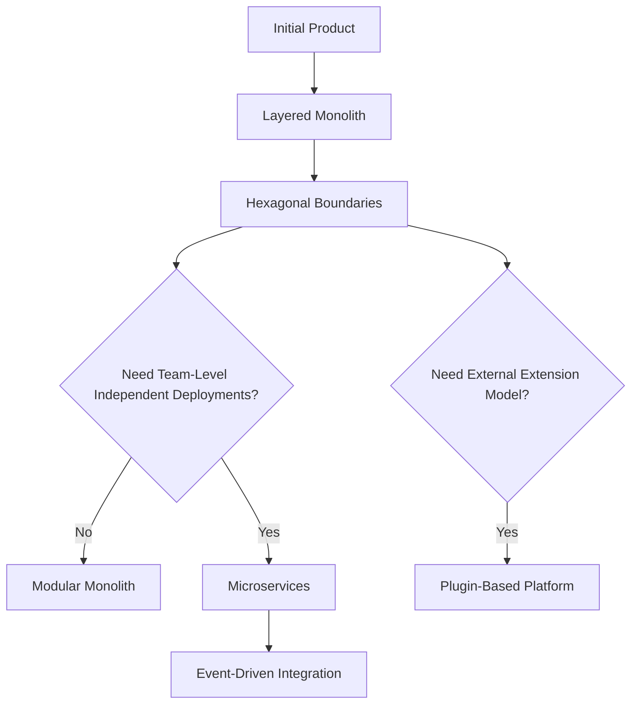

# Main Architecture Pattern Playbook


Production-style, code-first guide for 6 core architecture patterns with implementations in **three languages**:

- **C#** (full set, runnable with `dotnet`)
- **Java** (full set, runnable with `javac/java`)
- **C++** (full set, designed for C++17 toolchains)

## Why this repository exists

This repository is built as a practical reference for architects and senior engineers who need:

- side-by-side pattern comparison,
- runnable code examples,
- consistent structure across languages,
- direct links from concept -> implementation -> run command.

## Pattern Scope

1. Layered Architecture
2. Microservice Architecture
3. Event-Driven Architecture
4. Client-Server Architecture
5. Plugin-Based Architecture
6. Hexagonal Architecture

## Architecture Navigation

- Global comparison: [`docs/comparison.md`](docs/comparison.md)
- Layered: [`patterns/01-layered-architecture/README.md`](patterns/01-layered-architecture/README.md)
- Microservice: [`patterns/02-microservice-architecture/README.md`](patterns/02-microservice-architecture/README.md)
- Event-Driven: [`patterns/03-event-driven-architecture/README.md`](patterns/03-event-driven-architecture/README.md)
- Client-Server: [`patterns/04-client-server-architecture/README.md`](patterns/04-client-server-architecture/README.md)
- Plugin-Based: [`patterns/05-plugin-based-architecture/README.md`](patterns/05-plugin-based-architecture/README.md)
- Hexagonal: [`patterns/06-hexagonal-architecture/README.md`](patterns/06-hexagonal-architecture/README.md)

## Repository Layout

```text
Main_Architecture_Patern/
  docs/
    comparison.md
  patterns/
    01-layered-architecture/
    02-microservice-architecture/
    03-event-driven-architecture/
    04-client-server-architecture/
    05-plugin-based-architecture/
    06-hexagonal-architecture/
  examples/
    csharp/
      LayeredArchitectureDemo/
      MicroserviceArchitectureDemo/
      EventDrivenArchitectureDemo/
      ClientServerArchitectureDemo/
      PluginBasedArchitectureDemo/
      HexagonalArchitectureDemo/
    java/
      layered-architecture/
      microservice-architecture/
      event-driven-architecture/
      client-server-architecture/
      plugin-based-architecture/
      hexagonal-architecture/
    cpp/
      layered-architecture/
      microservice-architecture/
      event-driven-architecture/
      client-server-architecture/
      plugin-based-architecture/
      hexagonal-architecture/
```

## Full Implementation Matrix (Pattern x Language)

| Pattern | C# implementation | Java implementation | C++ implementation |
|---|---|---|---|
| Layered | [`examples/csharp/LayeredArchitectureDemo`](examples/csharp/LayeredArchitectureDemo) | [`examples/java/layered-architecture`](examples/java/layered-architecture) | [`examples/cpp/layered-architecture`](examples/cpp/layered-architecture) |
| Microservice | [`examples/csharp/MicroserviceArchitectureDemo`](examples/csharp/MicroserviceArchitectureDemo) | [`examples/java/microservice-architecture`](examples/java/microservice-architecture) | [`examples/cpp/microservice-architecture`](examples/cpp/microservice-architecture) |
| Event-Driven | [`examples/csharp/EventDrivenArchitectureDemo`](examples/csharp/EventDrivenArchitectureDemo) | [`examples/java/event-driven-architecture`](examples/java/event-driven-architecture) | [`examples/cpp/event-driven-architecture`](examples/cpp/event-driven-architecture) |
| Client-Server | [`examples/csharp/ClientServerArchitectureDemo`](examples/csharp/ClientServerArchitectureDemo) | [`examples/java/client-server-architecture`](examples/java/client-server-architecture) | [`examples/cpp/client-server-architecture`](examples/cpp/client-server-architecture) |
| Plugin-Based | [`examples/csharp/PluginBasedArchitectureDemo`](examples/csharp/PluginBasedArchitectureDemo) | [`examples/java/plugin-based-architecture`](examples/java/plugin-based-architecture) | [`examples/cpp/plugin-based-architecture`](examples/cpp/plugin-based-architecture) |
| Hexagonal | [`examples/csharp/HexagonalArchitectureDemo`](examples/csharp/HexagonalArchitectureDemo) | [`examples/java/hexagonal-architecture`](examples/java/hexagonal-architecture) | [`examples/cpp/hexagonal-architecture`](examples/cpp/hexagonal-architecture) |

## Key Entry Files

| Pattern | C# entry | Java entry | C++ entry |
|---|---|---|---|
| Layered | [`examples/csharp/LayeredArchitectureDemo/Program.cs`](examples/csharp/LayeredArchitectureDemo/Program.cs) | [`examples/java/layered-architecture/Main.java`](examples/java/layered-architecture/Main.java) | [`examples/cpp/layered-architecture/main.cpp`](examples/cpp/layered-architecture/main.cpp) |
| Microservice | [`examples/csharp/MicroserviceArchitectureDemo/Program.cs`](examples/csharp/MicroserviceArchitectureDemo/Program.cs) | [`examples/java/microservice-architecture/Main.java`](examples/java/microservice-architecture/Main.java) | [`examples/cpp/microservice-architecture/main.cpp`](examples/cpp/microservice-architecture/main.cpp) |
| Event-Driven | [`examples/csharp/EventDrivenArchitectureDemo/Program.cs`](examples/csharp/EventDrivenArchitectureDemo/Program.cs) | [`examples/java/event-driven-architecture/Main.java`](examples/java/event-driven-architecture/Main.java) | [`examples/cpp/event-driven-architecture/main.cpp`](examples/cpp/event-driven-architecture/main.cpp) |
| Client-Server | [`examples/csharp/ClientServerArchitectureDemo/Program.cs`](examples/csharp/ClientServerArchitectureDemo/Program.cs) | [`examples/java/client-server-architecture/SimpleServer.java`](examples/java/client-server-architecture/SimpleServer.java) + [`examples/java/client-server-architecture/SimpleClient.java`](examples/java/client-server-architecture/SimpleClient.java) | [`examples/cpp/client-server-architecture/main.cpp`](examples/cpp/client-server-architecture/main.cpp) |
| Plugin-Based | [`examples/csharp/PluginBasedArchitectureDemo/Program.cs`](examples/csharp/PluginBasedArchitectureDemo/Program.cs) | [`examples/java/plugin-based-architecture/Main.java`](examples/java/plugin-based-architecture/Main.java) | [`examples/cpp/plugin-based-architecture/main.cpp`](examples/cpp/plugin-based-architecture/main.cpp) |
| Hexagonal | [`examples/csharp/HexagonalArchitectureDemo/Program.cs`](examples/csharp/HexagonalArchitectureDemo/Program.cs) | [`examples/java/hexagonal-architecture/Main.java`](examples/java/hexagonal-architecture/Main.java) | [`examples/cpp/hexagonal-architecture/main.cpp`](examples/cpp/hexagonal-architecture/main.cpp) |

## Direct Run Commands

### C# (.NET 9)

```powershell
cd examples/csharp/LayeredArchitectureDemo; dotnet run
cd ../MicroserviceArchitectureDemo; dotnet run
cd ../EventDrivenArchitectureDemo; dotnet run
cd ../ClientServerArchitectureDemo; dotnet run
cd ../PluginBasedArchitectureDemo; dotnet run
cd ../HexagonalArchitectureDemo; dotnet run
```

### Java (JDK 21)

```powershell
cd examples/java/layered-architecture; javac Main.java; java Main
cd ../microservice-architecture; javac Main.java; java Main
cd ../event-driven-architecture; javac Main.java; java Main
cd ../client-server-architecture; javac SimpleServer.java SimpleClient.java
# terminal 1: java SimpleServer
# terminal 2: java SimpleClient
cd ../plugin-based-architecture; javac Main.java; java Main
cd ../hexagonal-architecture; javac Main.java; java Main
```

### C++ (C++17)

```powershell
cd examples/cpp/layered-architecture; g++ -std=c++17 -O2 main.cpp -o app; .\app.exe
cd ../microservice-architecture; g++ -std=c++17 -O2 main.cpp -o app; .\app.exe
cd ../event-driven-architecture; g++ -std=c++17 -O2 main.cpp -o app; .\app.exe
cd ../client-server-architecture; g++ -std=c++17 -O2 main.cpp -o app; .\app.exe
cd ../plugin-based-architecture; g++ -std=c++17 -O2 main.cpp -o app; .\app.exe
cd ../hexagonal-architecture; g++ -std=c++17 -O2 main.cpp -o app; .\app.exe
```

## Senior-Level Architecture Standards Used

### 1) Separation of concerns by boundary

- Layered: UI/business/persistence split.
- Hexagonal: ports/adapters with domain-centric use cases.
- Microservice: explicit gateway and service ownership.

### 2) Stable contracts

- DTO/events/ports are explicit.
- Plugin models use stable interface contracts.
- Request/response boundaries are isolated from internal storage.

### 3) Evolvability first

- Every pattern has a minimal but extensible baseline.
- Examples can be promoted from demo to production by adding DI, telemetry, auth, and persistence adapters.

### 4) Operational realism

- Event-driven examples demonstrate publish/subscribe flow.
- Client-server examples demonstrate socket-style request/response in C# and Java.
- Microservice examples demonstrate gateway orchestration and service-local state.

## Decision Shortcuts

- Choose **Layered** for fast delivery and predictable monolith structure.
- Choose **Hexagonal** when domain integrity and testability are mandatory.
- Choose **Microservice** when independent deployment and team autonomy matter more than simplicity.
- Choose **Event-Driven** when asynchronous fan-out and spike resistance are core requirements.
- Choose **Client-Server** for central backend with many clients.
- Choose **Plugin-Based** for platform extensibility and tenant/custom partner features.

## Suggested Evolution Path



## GitHub Language Visibility

This repository includes code for C#, Java, and C++ in dedicated folders under `examples/`.

To improve GitHub language statistics quality, a `.gitattributes` file marks docs as documentation, so language breakdown focuses on implementation code.

- Config file: [`.gitattributes`](.gitattributes)

## Next Expansion Ideas

1. Add production-ready variants with HTTP APIs and dependency injection containers for Java/C++ too.
2. Add architecture tests and contract tests for all patterns.
3. Add docker-compose profiles to run multi-pattern demos quickly.
