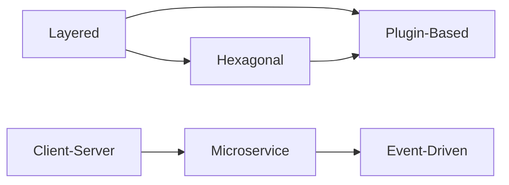
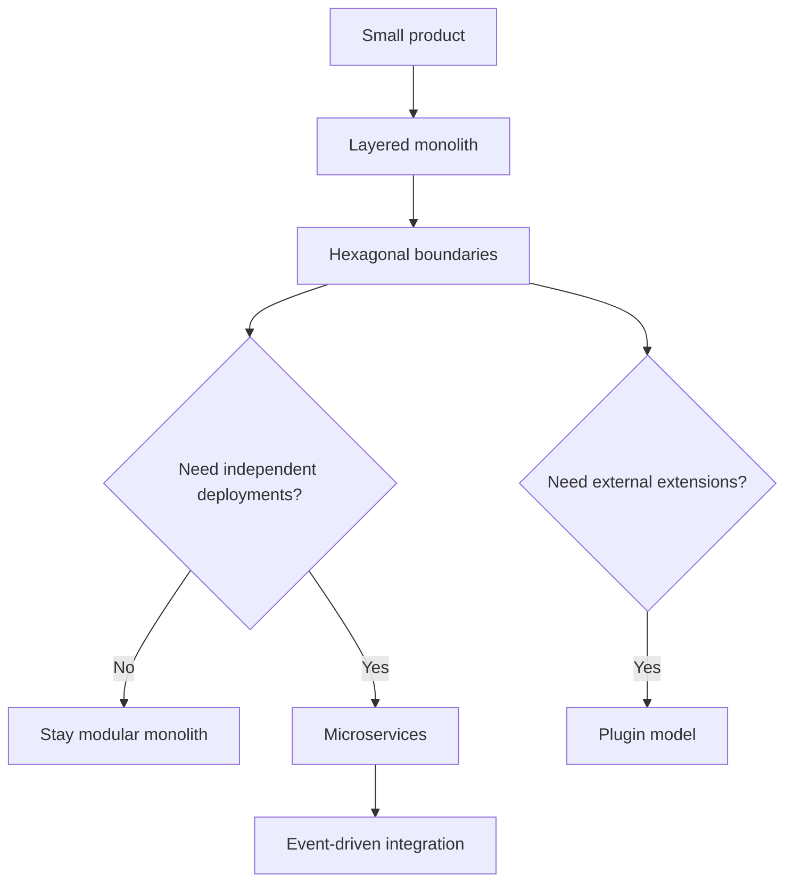

# Architecture Pattern Comparison Matrix

This document compares 6 major architecture patterns from the perspective of delivery speed, scalability, operability, and maintainability.

## Patterns in Scope

1. Layered Architecture
2. Microservice Architecture
3. Event-Driven Architecture
4. Client-Server Architecture
5. Plugin-Based Architecture
6. Hexagonal Architecture

## High-Level Topology

## Why and When

| Pattern | Why teams choose it | Typical trigger to adopt | What can go wrong |
|---|---|---|---|
| Layered | Fast onboarding, familiar structure, clear separation by technical role | Monolith with moderate complexity | Layer leakage, business logic in controllers, tight coupling to persistence |
| Microservice | Independent deployment, team autonomy, fault isolation | Many teams, uneven scaling, release bottlenecks in monolith | Distributed complexity, network failures, cost explosion |
| Event-Driven | High throughput, async processing, low temporal coupling | Need for near-real-time reactions, spikes, integrations | Hard tracing, eventual consistency bugs, replay complexity |
| Client-Server | Simple request/response mental model, direct control flow | Central service and many clients with clear API | Server bottleneck, state synchronization issues |
| Plugin-Based | Extensibility, custom features per tenant/customer, modular releases | Product platform strategy, partner ecosystem | Versioning hell, unsafe plugin boundaries |
| Hexagonal | Domain-centric design, testability, dependency inversion | Frequent infra changes, quality issues from framework coupling | More abstraction than needed for very small apps |

## Capability Matrix

Scale: `1 = low`, `5 = high`

| Pattern | Dev speed | Runtime scalability | Operability complexity | Testability | Fault isolation | Team scaling | Change cost |
|---|---:|---:|---:|---:|---:|---:|---:|
| Layered | 5 | 2 | 2 | 3 | 2 | 2 | 3 |
| Microservice | 2 | 5 | 5 | 3 | 5 | 5 | 4 |
| Event-Driven | 3 | 5 | 4 | 3 | 4 | 4 | 4 |
| Client-Server | 4 | 3 | 2 | 3 | 2 | 3 | 3 |
| Plugin-Based | 3 | 3 | 4 | 4 | 3 | 4 | 4 |
| Hexagonal | 3 | 3 | 3 | 5 | 3 | 4 | 4 |

## Data and Consistency Trade-offs

| Pattern | Data ownership | Consistency model | Transaction strategy |
|---|---|---|---|
| Layered | Usually shared relational DB | Strong consistency in one process | ACID local transactions |
| Microservice | Service-owned data stores | Mix of strong local + eventual cross-service | Sagas, outbox, retries |
| Event-Driven | Producers own write model, consumers own projections | Eventual consistency by default | At-least-once with idempotent handlers |
| Client-Server | Central server data owner | Usually strong consistency | Centralized transaction boundaries |
| Plugin-Based | Host owns core data, plugins may extend metadata | Depends on host contracts | Contract-governed hooks |
| Hexagonal | Domain model owns invariants, adapters map storage | Depends on adapter capabilities | Domain transaction boundary + adapter execution |

## Cost and Team Impact

| Pattern | Infra cost | Required seniority | Team topology fit |
|---|---|---|---|
| Layered | Low | Low to medium | Single team or small department |
| Microservice | High | High | Many cross-functional teams |
| Event-Driven | Medium to high | Medium to high | Product + platform split |
| Client-Server | Low to medium | Low to medium | Central backend + multiple clients |
| Plugin-Based | Medium | Medium to high | Core platform team + extension teams |
| Hexagonal | Medium | Medium | Domain-focused team with clear boundaries |

## Pattern Pairing Guide

| Goal | Recommended pairing | Why |
|---|---|---|
| Start simple, keep growth path | Layered + Hexagonal principles | Keep monolith shape, improve dependency direction |
| Scale by team and load | Microservice + Event-Driven | Independent services with async integration |
| Build platform ecosystem | Hexagonal + Plugin-Based | Stable ports plus extension points |
| Multi-channel apps | Client-Server + Event-Driven | Sync API for user actions, async bus for side effects |

## C# vs Java vs C++ Practical Notes

| Concern | C# | Java | C++ |
|---|---|---|---|
| Best fit in this repository | Full examples for all 6 patterns | Full examples for all 6 patterns | Full examples for all 6 patterns |
| Typical strengths | .NET DI, async model, rapid enterprise delivery | Mature JVM networking and ecosystem | Performance, control, static binary plugins |
| Trade-off | Framework-heavy conventions | Verbosity without frameworks | Higher memory/lifecycle complexity |

## Detailed Pattern Pages

- `patterns/01-layered-architecture/README.md`
- `patterns/02-microservice-architecture/README.md`
- `patterns/03-event-driven-architecture/README.md`
- `patterns/04-client-server-architecture/README.md`
- `patterns/05-plugin-based-architecture/README.md`
- `patterns/06-hexagonal-architecture/README.md`

## Architectural Evolution Path

