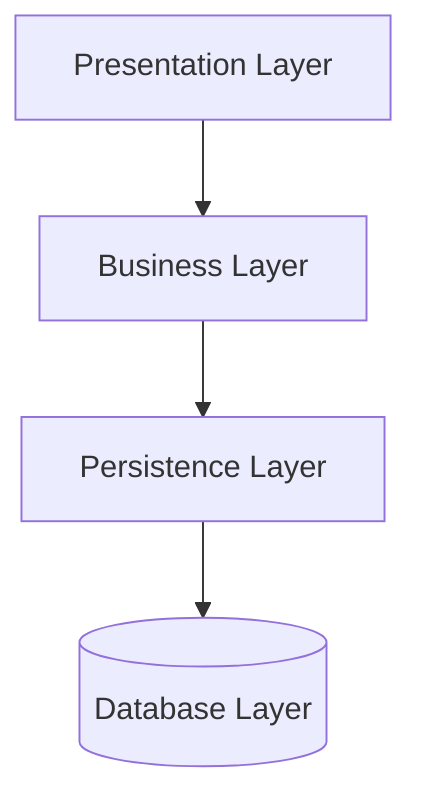
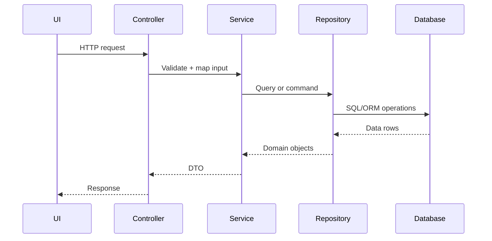

# Layered Architecture

Layered architecture organizes code by technical responsibilities. A common shape is Presentation -> Business -> Persistence -> Database.

## Why use it

- Fast to start for CRUD-heavy systems.
- Familiar structure for most teams.
- Easy separation of controller/service/repository responsibilities.

## When it is strong

- Single deployable backend.
- Moderate domain complexity.
- Team wants predictable folder structure.

## Risks

- Business rules leak into controllers.
- Layers become pass-through wrappers.
- Tight coupling to ORM or storage conventions.

## Structure Diagram

## Runtime Flow

## Implementations

- C#: [`examples/csharp/LayeredArchitectureDemo`](../../examples/csharp/LayeredArchitectureDemo)
- Java: [`examples/java/layered-architecture`](../../examples/java/layered-architecture)
- C++: [`examples/cpp/layered-architecture`](../../examples/cpp/layered-architecture)
