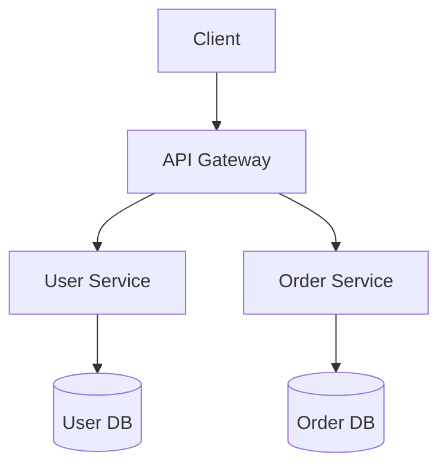
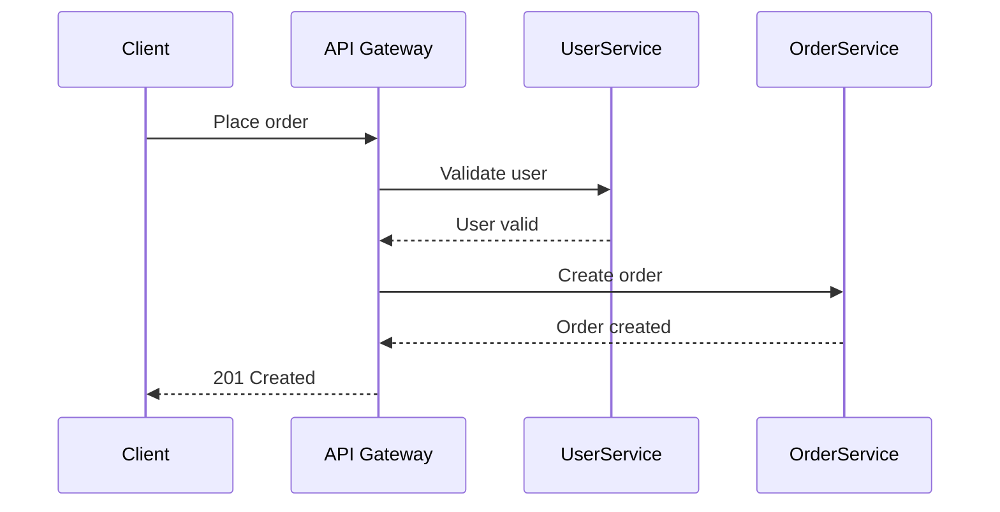

# Microservice Architecture

Microservice architecture splits a system into independently deployable services around business capabilities.

## Why use it

- Independent deployment per service.
- Better team autonomy.
- Service-level scaling and fault isolation.

## When it is strong

- Multiple teams ship in parallel.
- Different components have different scaling profiles.
- Need strict ownership boundaries.

## Risks

- Operational overhead (observability, platform, CI/CD).
- Distributed transactions and consistency issues.
- Increased debugging complexity across service boundaries.

## Structure Diagram

## Runtime Flow

## Implementations

- C#: [`examples/csharp/MicroserviceArchitectureDemo`](../../examples/csharp/MicroserviceArchitectureDemo)
- Java: [`examples/java/microservice-architecture`](../../examples/java/microservice-architecture)
- C++: [`examples/cpp/microservice-architecture`](../../examples/cpp/microservice-architecture)
