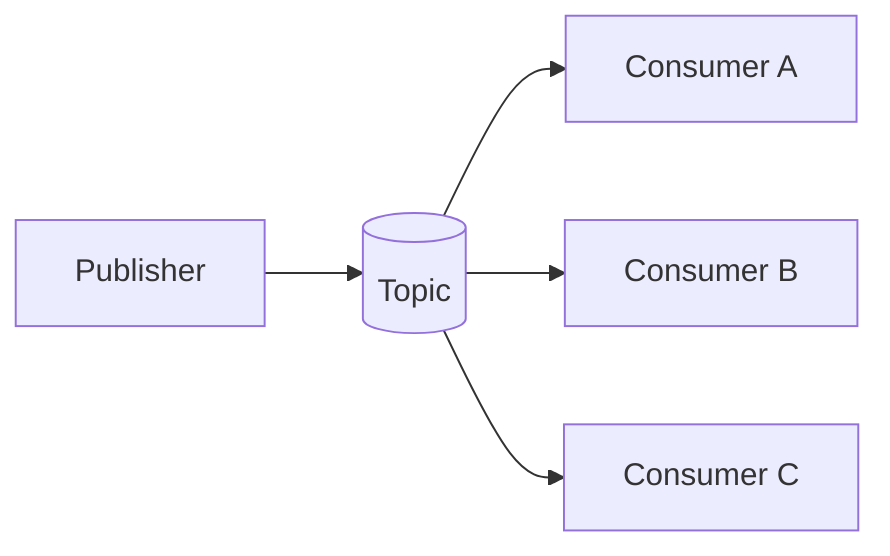
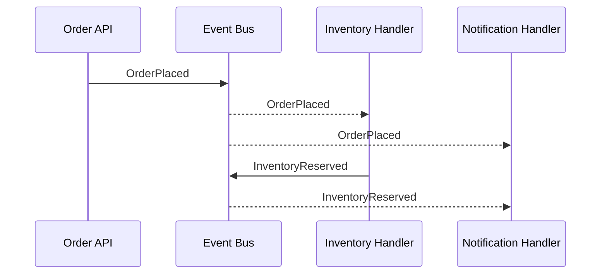

# Event-Driven Architecture

Event-driven architecture exchanges facts (events) through a broker/topic so producers and consumers are loosely coupled.

## Why use it

- Handles bursts with asynchronous buffering.
- Supports independent consumers for the same event.
- Enables reactive workflows.

## When it is strong

- Integrations with many downstream systems.
- Non-blocking side effects (email, analytics, fulfillment).
- Need to fan out one action into many reactions.

## Risks

- Eventual consistency surprises.
- Hard end-to-end tracing.
- Schema evolution and duplicate delivery handling.

## Structure Diagram

## Runtime Flow

## Implementations

- C#: [`examples/csharp/EventDrivenArchitectureDemo`](../../examples/csharp/EventDrivenArchitectureDemo)
- Java: [`examples/java/event-driven-architecture`](../../examples/java/event-driven-architecture)
- C++: [`examples/cpp/event-driven-architecture`](../../examples/cpp/event-driven-architecture)
