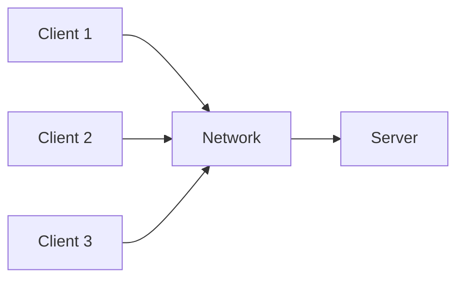
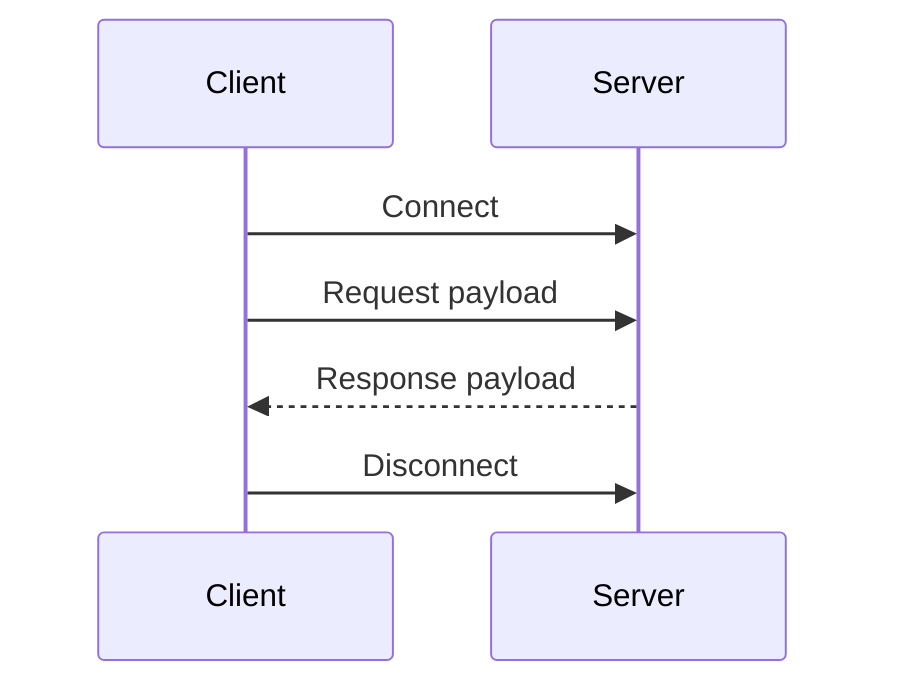

# Client-Server Architecture

Client-server architecture separates user-facing clients from a centralized server that processes requests and returns responses.

## Why use it

- Simple and predictable interaction model.
- Centralized control and security policy.
- Works for desktop, mobile, and web clients.

## When it is strong

- Request/response dominated workflows.
- Real-time state synchronization is manageable from a central point.
- Network protocol and API are stable.

## Risks

- Server can become bottleneck.
- Tight coupling between client version and API contract.
- Horizontal scale requires explicit stateless design.

## Structure Diagram

## Runtime Flow

## Implementations

- C#: [`examples/csharp/ClientServerArchitectureDemo`](../../examples/csharp/ClientServerArchitectureDemo)
- Java: [`examples/java/client-server-architecture`](../../examples/java/client-server-architecture)
- C++: [`examples/cpp/client-server-architecture`](../../examples/cpp/client-server-architecture)
