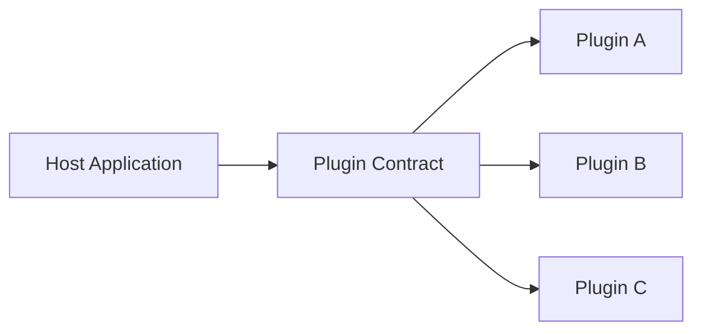
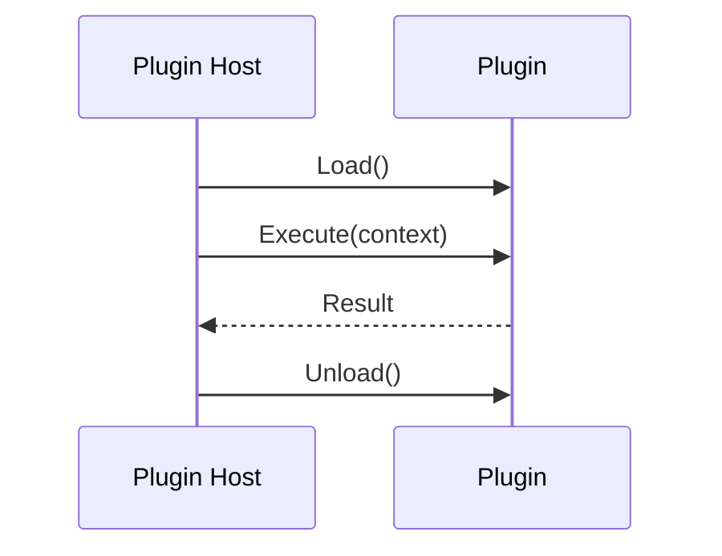

# Plugin-Based Architecture

Plugin-based architecture keeps a small stable core and lets optional modules extend behavior via contracts.

## Why use it

- Supports extensibility without rebuilding the core.
- Enables partner or customer-specific features.
- Keeps feature boundaries explicit.

## When it is strong

- Product platform strategy.
- Domain requires optional workflows.
- Versioned extension API can be maintained.

## Risks

- Binary compatibility breaks.
- Plugin isolation and safety concerns.
- Discovery/loading/version management overhead.

## Structure Diagram

## Runtime Flow

## C# Example

- Path: `examples/csharp/PluginBasedArchitectureDemo`
- Demonstrates discovery of plugins by interface.

## C++ Example

- Path: `examples/cpp/plugin-based`
- Demonstrates host and plugins using abstract interface.
