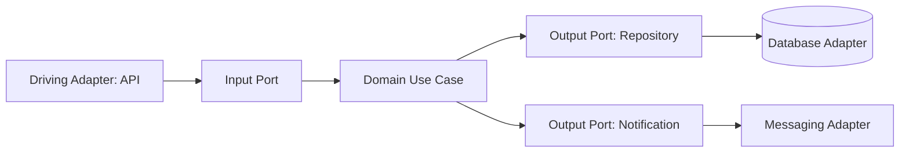
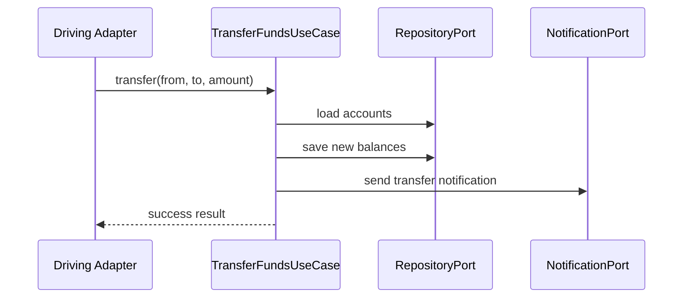

# Hexagonal Architecture

Hexagonal architecture (Ports and Adapters) keeps domain logic in the center and isolates infrastructure behind ports.

## Why use it

- Strong testability for domain use cases.
- Infrastructure replacement with minimal domain impact.
- Explicit boundaries around side effects.

## When it is strong

- Domain complexity is high.
- Multiple delivery channels or adapters exist.
- Frequent infrastructure changes are expected.

## Risks

- Additional abstractions can slow small teams.
- Poorly designed ports become generic wrappers.
- Requires discipline to keep adapters thin.

## Structure Diagram

## Runtime Flow

## Implementations

- C#: [`examples/csharp/HexagonalArchitectureDemo`](../../examples/csharp/HexagonalArchitectureDemo)
- Java: [`examples/java/hexagonal-architecture`](../../examples/java/hexagonal-architecture)
- C++: [`examples/cpp/hexagonal-architecture`](../../examples/cpp/hexagonal-architecture)
